[](https://classroom.github.com/open-in-codespaces?assignment_repo_id=10117783)
# Практична робота "Масиви, вирази, керування виконанням програми"

Цей репозиторій містить стартовий код для виконання практичної роботи, який містить заготовки двох класів, що демонструють структуру проекту для виконання завдань на масиви, керуючі конструкції та вирази.

## В рамках практичної роботи ви маєте зробити наступне:
1. модифікувати стартовий код таким чином, щоб метод ```Calculate``` класу ```Exercise``` містив код обчислення значення у відповідності до обраного вами завдання (у разі необхідності можна додавати до класу нові приватні методи)
2. рядок, який виводиться у результаті виконання методу ```main``` класу ```TestResult``` теж слід скоригувати у відповідності до специфіки завдання
3. **README.MD репозиторію має містити опис обраного вами завдання** (краще - з картинками та форматуванням :blush:)!
4. **УВАГА!** Не слід вважати, що завдання дуже прості! Вам необхідно подбати про:
    * **оптимізацію програми - обрати оптимальні з точки зору обсягу використовуваної пам'яті типи даних**
    * **іменування змінних і констант у відповідності до рекомендацій**
    * **javadoc-коментарі для класу ```Exercise```, які пояснюють що саме обчислюється і які вихідні дані для цього потрібні**
5. здати завдання. **Нагадую, що здаючи завдання через Google Classroom, слід вказати посилання на створений для вас репозиторій!**

**P.S.** Ви можете обрати завдання на власний розсуд - реалізувати алгоритм, який вас зацікавив, однак якщо буде надто багато однакових класів, завдання не буде зараховано - намагайтесь робити самотужки та у власному стилі! Звісно ж, ніхто не забороняє користуватись Інтернетом, шукати й використовувати знайдене у Мережі. А ще - обговорювати завдання в девелоперському мессенджері **Gitter** - у відповідній [чат-кімнаті](https://gitter.im/PPC-SE-2020/OOP?utm_source=share-link&utm_medium=link&utm_campaign=share-link).

[](https://gitter.im/PPC-SE-2020/OOP?utm_source=badge&utm_medium=badge&utm_campaign=pr-badge)

----

## Список завдань

----

Основний код для визову программ
```java
package test;

import domain.*;

import java.util.Scanner;

public class TestResult {


    public static void main(String[] args) {
        Scanner scanner = new Scanner(System.in);

        System.out.println("\u001B[31m" + "Введіть номер завдання" +  "\u001B[0m");
        System.out.println("1. Заповніть масив простими числами з вказаного діапазону і виведіть його у вигляді рядка \n" +
                "2. Заповнити масив довільного розміру числами в порядку зростання, починаючи з центру масиву, наприклад, [5,4,3,2,1,0,1,2,3,4,5] \n" +
                "3. Знайти в масиві число, яке повторюється найбільшу кількість разів\n" +
                "4. Рядок містить математичний вираз типу \"1 + 33-4 * 7\". Написати програму для підрахунку значення виразу (пріоритет операцій можна не враховувати)\n" +
                "5. Знайти всі різні подання числа N у вигляді сум K натуральних чисел (1 <K <N). Якщо К = 0, то видати всі можливі суми. Подання чисел, що відрізняються лише порядком доданків, вважаються однаковими (Не завершенная) \n" +
                "7. Трамвайні квитки мають шестизначні номери, вважають якщо квиток «щасливий» то сума перших трьох цифр дорівнює сумі останніх. Знайти кількість щасливих квитків");
        int key = scanner.nextInt();

        if(key == 1){
            System.out.println("Введіть мінімальне число");
            int min = scanner.nextInt();
            System.out.println("Введіть максимальне число");
            int max = scanner.nextInt();
            System.out.println("Введіть кількість комірок");
            int num = scanner.nextInt();
            FillArray.Calculate(min, max, num);
        } else if (key == 2) {
            System.out.println("Введіть кількість комірок (найкраще не парне)");
            int num = scanner.nextInt();
            CenterArray.Calculate(num);
        } else if (key == 3) {
            System.out.println("Введіть мінімальне число");
            int min = scanner.nextInt();
            System.out.println("Введіть максимальне число");
            int max = scanner.nextInt();
            System.out.println("Введіть кількість комірок");
            int num = scanner.nextInt();
            TheLargestNumber.Calculate(min, max, num);
        } else if (key == 4) {
            System.out.println("Введіть мінімальне число");
            int min = scanner.nextInt();
            System.out.println("Введіть максимальне число");
            int max = scanner.nextInt();
            System.out.println("Введіть кількість комірок");
            int num = scanner.nextInt();
            MathArray.Calculate(min, max, num);
        } else if (key == 5) {
            SumN.Calculate(20, 2);
        } else if(key == 7){ // Основная задача с задания
            System.out.println("Введіть кількість квитків");
            int num = scanner.nextInt();
            Tickets.Calculate (num);
        }


    }
}
```

Вводимо номер завдання, яке э в списку
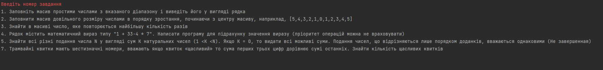


1. Заповніть масив простими числами з вказаного діапазону і виведіть його у вигляді рядка
```java
package domain;

import java.util.ArrayList;
import java.util.List;


public class FillArray {
   public static void Calculate(int minNum, int maxNum, int N){

      int min = minNum;
      int max = maxNum;
      int range = max - min + 1;

      List<Integer> numbers = new ArrayList<>();

      for(int i = 0; i < N; i++){
         numbers.add(i, (int)(Math.random() * range) + min);
      }

      for (int i = 0; i < numbers.size(); i++){
         System.out.print("\u001B[36m" + numbers.get(i) + " | ");
      }

   }

}
 
```

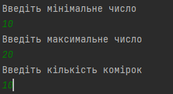


2. Заповнити масив довільного розміру числами в порядку зростання, починаючи з центру масиву, наприклад, ````[5,4,3,2,1,0,1,2,3,4,5]````
```java
   package domain;

import java.util.ArrayList;
import java.util.List;

public class CenterArray {
public static void Calculate(int num){
List<Integer> numbers = new ArrayList<>();
for (int i = 0; i < num; i++){
numbers.add(i, 0);
}

        int center = num / 2;
        for (int i = center, j = 0; 0 <= i; i--, j++){
            numbers.set(i, j);
        }
        for (int i = center + 1, j = 1; i < numbers.size(); i++, j++){
            numbers.set(i, j);
        }
        System.out.println("\u001B[36m" + numbers);
    }
}
```
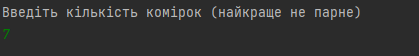

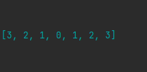

3. Знайти в масиві число, яке повторюється найбільшу кількість разів

```java
package domain;

import java.util.ArrayList;
import java.util.List;

public class TheLargestNumber {
    public static void Calculate(int minNum, int maxNum, int num){
        int min = minNum;
        int max = maxNum;
        int range = max - min + 1;

        List<Integer> numbers = new ArrayList<>();

        for(int i = 0; i < num; i++){
            numbers.add(i, (int)(Math.random() * range) + min);
        }
        System.out.println(numbers);
        int number = 0;
        int counter = 0;
        int tempCounter = 0;
        for(int i = 0; i < numbers.size(); i++){
            for (int j = 0; j < numbers.size(); j++){
                if(numbers.get(i) == numbers.get(j)){
                    tempCounter++;
                }
                if(tempCounter > counter){
                    counter = tempCounter;
                    number = numbers.get(i);
                }
            }
            tempCounter = 0;
        }

        System.out.println("\u001B[36m" + "Число которое повторяется = " + number);
        System.out.println("\u001B[36m" + "Число повторений = " + counter);
    }
}

```

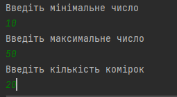

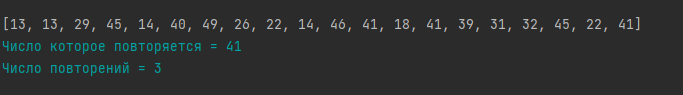

4. Рядок містить математичний вираз типу "1 + 33-4 * 7". Написати програму для підрахунку значення виразу (пріоритет операцій можна не враховувати)

```java
package domain;

import java.util.ArrayList;
import java.util.List;

public class MathArray {
    public static void Calculate(int minNum, int maxNum, int N) {

        int min = minNum;
        int max = maxNum;
        int range = max - min + 1;

        int[] numbers = new int[N];

        for(int i = 0; i < N; i++){
            numbers[i] = (int)(Math.random() * range) + min;
        }

        long result = 0;

        for(int i = 0; i < N; i++){
            short sing = (short) (Math.random() * (4 - 0 + 1));
            if(sing == 1 || sing == 0) {
                System.out.println((i + 1) + ". " + result + " + " + numbers[i]);
                result += numbers[i];
            }else if(sing == 2){
                System.out.println((i + 1) + ". " + result + " - " + numbers[i]);
                result -= numbers[i];
            }else if(sing == 3){
                System.out.println((i + 1) + ". " + result + " * " + numbers[i]);
                result *= numbers[i];
            }else if(sing == 4){
                System.out.println((i + 1) + ". " + result + " : " + numbers[i]);
                result /= numbers[i];
            }
        }
        System.out.println(" ");
        System.out.println("Результ обчислення: " + result);
    }
}

```
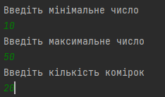

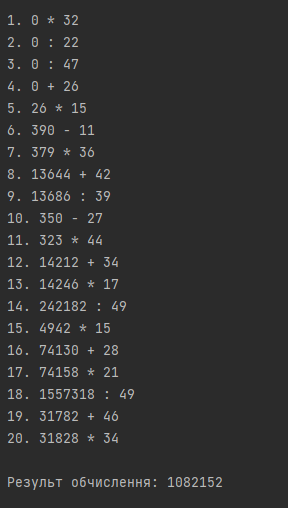

5. Знайти всі різні подання числа N у вигляді сум K натуральних чисел (1 <K <N). Якщо К = 0, то видати всі можливі суми. Подання чисел, що відрізняються лише порядком доданків, вважаються однаковими

```java
package domain;

import javax.swing.plaf.IconUIResource;
import java.util.ArrayList;
import java.util.List;

public class SumN {
    public static void Calculate(int N, int K){
        List<Integer> array = new ArrayList<>();
        List<List<Integer>> array2 = new ArrayList<>();

        for(int i = 1; i < N; i++){
            array.add(i);
        }
        System.out.println(array);

        for(int i = 0; i < array.size(); i++){
            for(int j = 0; j < array.size() ; j++){
                if(array.get(i) + array.get(j) == N){
                    List<Integer> temp = new ArrayList<>();
                    temp.add(array.get(i));
                    temp.add(array.get(j));
                    array2.add(temp);
                }
            }
        }

        for (int i = 0; i < array2.size(); i++){
            List<Integer> temp = new ArrayList<>();
            temp = array2.get(i);

        }
        System.out.println(array2);
        for(int i = 0; i < array2.size(); i++){
            List<Integer> fTemp = new ArrayList<>();
            for(int j = 0; j < array2.size(); j++){
                List<Integer> sTemp = new ArrayList<>();
                fTemp = array2.get(i);
                sTemp = array2.get(j);
                if ((fTemp.get(0) == sTemp.get(0) && fTemp.get(0) == sTemp.get(0)) &&(fTemp.get(1) == sTemp.get(1) && fTemp.get(1) == sTemp.get(1))){

                }
                else if(fTemp.get(0) == sTemp.get(1) && fTemp.get(1) == sTemp.get(0)){
                    array2.remove(j);
                }
            }
        }

        System.out.println(array2);
    }
}

```
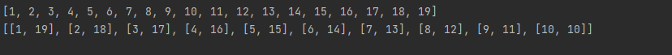

7. Трамвайні квитки мають шестизначні номери, вважають якщо квиток «щасливий» то сума перших трьох цифр дорівнює сумі останніх. Знайти кількість щасливих квитків

```java
 package domain;

import java.util.ArrayList;
import java.util.List;

public class Tickets {
   public static void Calculate(int N){
      int counter = 0;

      int min = 100000;
      int max = 600000;
      int range = max - min + 1;
      List<Integer> tickets = new ArrayList<>();

      for (int i = 0; i < N; i++){
         tickets.add(i, (int)(Math.random() * range) + min);
      }
      System.out.println("Номера квитків = " + tickets);
      for(int i = 0; i < N; i++){
         String tempStr = String.valueOf(tickets.get(i));
         char[] chars = new char[6];
         tempStr.getChars(0, 6, chars, 0);

         int firstSum = 0;
         int secondSum = 0;
         for (int j = 0; j < 6; j++){
            int temp = Character.digit(chars[j], 10);
            if (j < 3){
               firstSum += temp;
            }else{
               secondSum += temp;
            }
         }
         if (firstSum == secondSum){
            counter++;
         }
      }

      System.out.println("\u001B[36m" + "Кількість щасливих білетів = " + counter);
   }
}

```

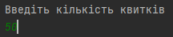
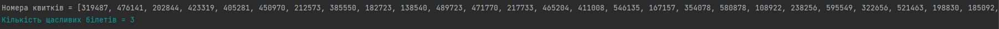